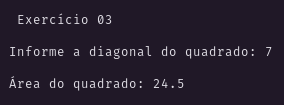
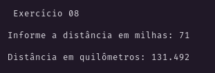
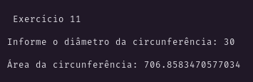

<h3 align="center">

Trabalho prático 01

</h3>

<!-- 

  <a href="#Proposta">Proposta</a> |
  <a href="#Resultado">Resultado</a>

 -->

# Exercícios

## 01
Entrar via teclado com a `base` e a `altura` de um retângulo, calcular e exibir sua `área`.

*<a href="./EX_01.java">Resolução</a>*
### Resultado:

  

## 02
Calcular e exibir a `área` de um quadrado, a partir do valor de sua `aresta` que será digitado.

*<a href="./EX_02.java">Resolução</a>*
### Resultado:

  

## 03
Calcular e exibir a `área` de um quadrado a partir do valor de sua `diagonal` que será digitado.

*<a href="./EX_03.java">Resolução</a>*
### Resultado:

  

## 04
A partir dos valores da `base` e `altura` de um triângulo, calcular e exibir sua `área`.

*<a href="./EX_04.java">Resolução</a>*
### Resultado:

  

## 05
Calcular e exibir o `volume` de uma esfera a partir do valor de seu `diâmetro` que será digitado.

*<a href="./EX_05.java">Resolução</a>*
### Resultado:

  

## 06
Calcular e exibir a **média aritmética** de **quatro valores** quaisquer que serão digitados.

*<a href="./EX_06.java">Resolução</a>*
### Resultado:

  

## 07
Calcular e exibir a **média geométrica** de **dois valores** quaisquer que serão digitados.

*<a href="./EX_07.java">Resolução</a>*
### Resultado:

  

## 08
Sabendo que **uma milha marítima** equivale a **um mil, oitocentos e cinquenta e dois metros**
e que **um quilômetro possui mil metros**,
fazer um programa para converter milhas marítimas em quilômetros.

*<a href="./EX_08.java">Resolução</a>*
### Resultado:

  

## 09
Calcular e exibir a `tensão` de um determinado circuito eletrônico a partir dos valores da `resistência` e `corrente elétrica` que serão digitados.

**Obs**: Utilize a lei de Ohm.

*<a href="./EX_09.java">Resolução</a>*
### Resultado:

  

## 10
Entrar via teclado com o valor de uma `temperatura` em graus Celsius, calcular e exibir sua temperatura equivalente em Fahrenheit.

*<a href="./EX_10.java">Resolução</a>*
### Resultado:

  

## 11
A partir do `diâmetro` de um círculo que será digitado, calcular e exibir sua `área`.

*<a href="./EX_11.java">Resolução</a>*
### Resultado:

  

## 12
Calcular e exibir o `volume` de um cone a partir dos valores da `altura` e do `raio` da base que serão digitados.

*<a href="./EX_12.java">Resolução</a>*
### Resultado:

  

## 13
Calcular e exibir a `velocidade final` (em km/h) de um automóvel, a partir dos valores da
`velocidade inicial` (em m/s), da `aceleração` (m/s²) e do `tempo de percurso` (em s) que serão digitados.

*<a href="./EX_13.java">Resolução</a>*
### Resultado:

  

## 14
Calcular e exibir o `volume` livre de um ambiente que contém uma esfera de raio `r` inscrita em um cubo perfeito de aresta `a`.
Os valores de `r` e `a` serão digitados.

*<a href="./EX_14.java">Resolução</a>*
### Resultado:

  

## 15
Entrar via teclado com o valor da `cotação do dólar` e uma certa `quantidade` de dólares.
Calcular e exibir o valor `correspondente em Reais` (R$).

*<a href="./EX_15.java">Resolução</a>*
### Resultado:

  

## 16
Entrar via teclado com o valor de um `ângulo` em graus, calcular e exibir as seguintes funções trigonométricas:

 - seno
 - cosseno
 - tangente
 - secante

Lembre-se que uma função trigonométrica trabalha em *radianos*.

*<a href="./EX_16.java">Resolução</a>*
### Resultado:

  

## 17
Entrar via teclado com dois valores quaisquer `X` e `Y`.
Calcular e exibir o cálculo XY (`X` elevado a `Y`).
**Obs**: Pesquisar as funções Exp e Ln.

*<a href="./EX_17.java">Resolução</a>*
### Resultado:

  

## 18
Entrar via teclado com o valor de *cinco produtos*.
Após as entradas, digitar um *valor referente ao pagamento* da somatória destes valores.
Calcular e exibir o *troco* que deverá ser devolvido.

*<a href="./EX_18.java">Resolução</a>*
### Resultado:

  

