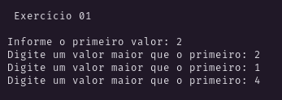
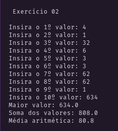
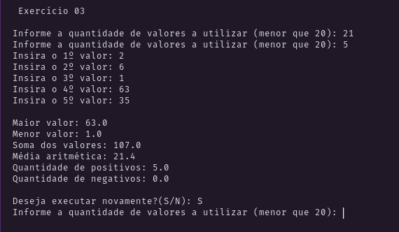
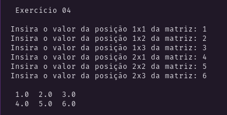
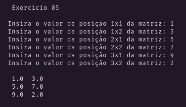
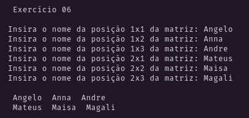
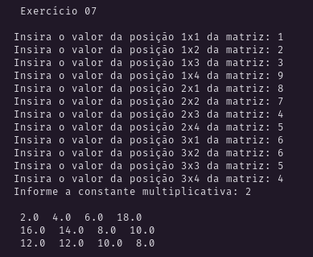
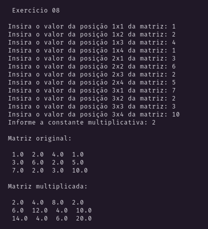
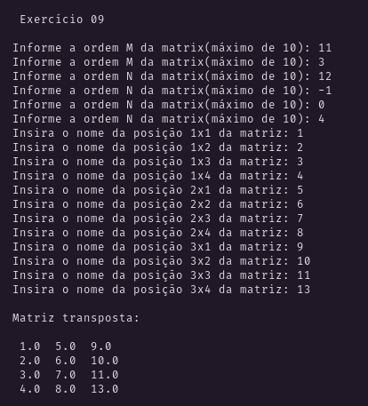

<h3 align="center">

Trabalho prático 02

</h3>

# Exercícios

## 01

Entrar com **dois valores** via teclado, **onde o segundo valor deverá ser maior que o primeiro**.
Caso contrário solicitar novamente apenas o segundo valor.

_<a href="./src/EX_01.java">Resolução</a>_

### Resultado:

  

## 02

Entrar via teclado com dez valores positivos.
Consistir a digitação e enviar mensagem de erro, se necessário.
Após a digitação, exibir:

- O maior valor;
- A soma dos valores;
- A média aritmética dos valores.

_<a href="./src/EX_02.java">Resolução</a>_

### Resultado:

  

## 03

Entrar via teclado com “N” valores quaisquer.

O valor “N” (que representa a quantidade de números) será digitado,
deverá ser positivo, porém menor que vinte.

Caso a quantidade não satisfaça a restrição,
enviar mensagem de erro e solicitar o valor novamente.

Após a digitação dos “N” valores, exibir:

- O maior valor;
- O menor valor;
- A soma dos valores;
- A média aritmética dos valores;
- A porcentagem de valores que são positivos;
- A porcentagem de valores negativos;

Após exibir os dados, perguntar ao usuário de deseja ou não uma nova execução do programa.

Consistir a resposta no sentido de aceitar somente “S” ou “N” e encerrar o programa em função dessa resposta.

_<a href="./src/EX_03.java">Resolução</a>_

### Resultado:

  

## 04

Armazenar seis valores em uma matriz de ordem 2x3. Apresentar os valores na tela.

_<a href="./src/EX_04.java">Resolução</a>_

### Resultado:

  

## 05

Armazenar seis valores em uma matriz de ordem 3x2. Apresentar os valores na tela.

_<a href="./src/EX_05.java">Resolução</a>_

### Resultado:

  

## 06

Armazenar seis nomes em uma matriz de ordem 2x3. Apresentar os nomes na tela.

_<a href="./src/EX_06.java">Resolução</a>_

### Resultado:

  

## 07

Entrar via teclado com doze valores e armazená-los em uma matriz de ordem 3x4.
Após a digitação dos valores solicitar uma constante multiplicativa,
que deverá multiplicar cada valor matriz e armazenar o resultado na própria matriz,
nas posições correspondentes.

_<a href="./src/EX_07.java">Resolução</a>_

### Resultado:

  

## 08

Entrar via teclado com doze valores e armazená-los em uma matriz de ordem 3x4.

Após a digitação dos valores solicitar uma constante multiplicativa,
que deverá multiplicar cada valor matriz e armazenar o resultado em outra matriz de mesma ordem,
nas posições correspondentes.

Exibir as matrizes na tela, sob a forma matricial, ou seja, linhas por colunas.

_<a href="./src/EX_08.java">Resolução</a>_

### Resultado:

  

## 09

Entrar com uma matriz de ordem MxN, onde a ordem também será escolhida pelo usuário,
sendo que no máximo 10x10.

A matriz não precisa ser quadrática.
Após a digitação dos elementos, calcular e exibir a matriz transposta.

_<a href="./src/EX_09.java">Resolução</a>_

### Resultado:

  

## 😞 10

_Não consegui fazer ainda_

Entrar com uma matriz de ordem MxM, onde a ordem também será escolhida pelo usuário,
sendo que no máximo será de ordem 10 e quadrática.

Após a digitação dos elementos, calcular e exibir a matriz inversa.
Exibir as matrizes na tela, sob a forma matricial (linhas x colunas).

<!-- _<a href="./src/EX_09.java">Resolução</a>_ -->

### Resultado:

_Sem resultados por aqui..._

<!-- 

  

 -->

## 😞 11

_Não consegui fazer ainda_

Entrar com uma matriz de ordem MxM, onde a ordem também será escolhida pelo usuário,
sendo que no máximo será de ordem 10 e quadrática.

Após a digitação dos elementos, calcular e exibir determinante da matriz.

<!-- _<a href="./src/EX_09.java">Resolução</a>_ -->

### Resultado:

_Sem resultados por aqui..._

<!-- 

  

 -->

